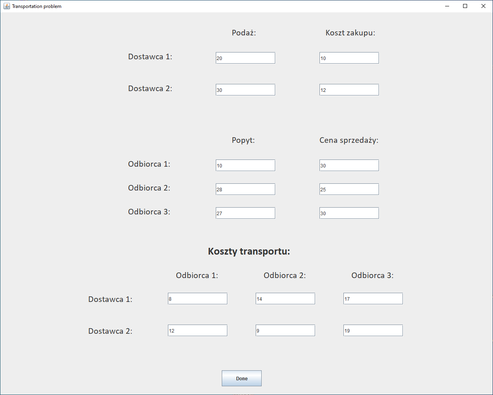
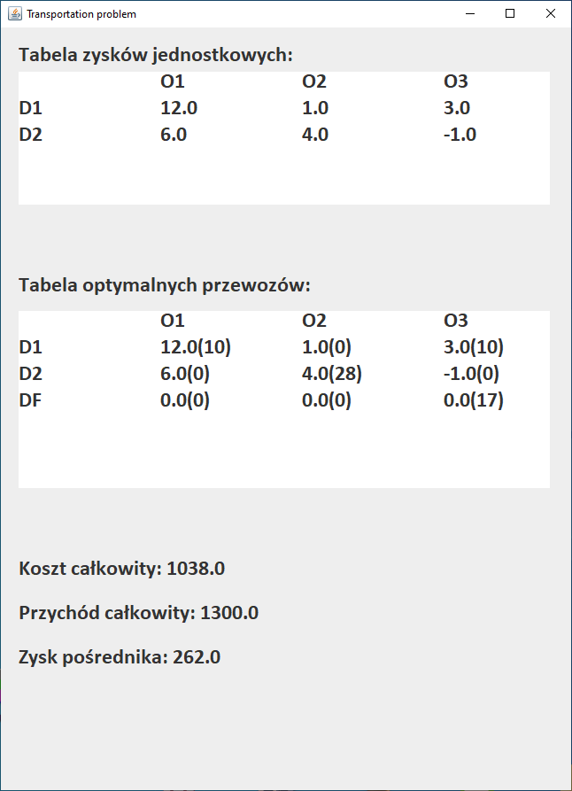

# logistics-transportation-problem

## Project prepared by:
- Pawel Gerlach
- Eryk Jalowiec

## Excercise goals & objectives:

Get acquainted with transportation problem, and how to solve it, as well as arranging the buying, transportation and selling plan in the way that the middleman gets the highest profit.

## Prerequisites:

Number of suppliers - 2\
Number of receivers - 3\
Application - Desktop application\
Technologies used - Java + Swing

### How to use the application:

Run the Main function. The application window will appear. In the window enter the data, e.g.

You will be given the results:

